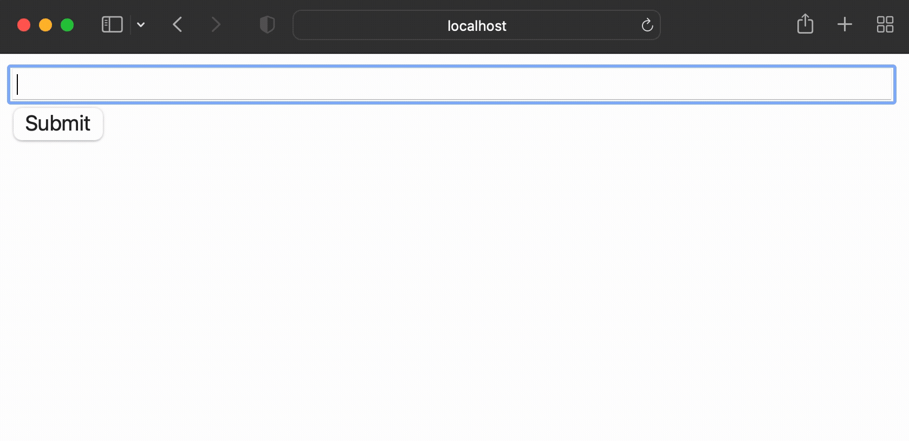

# Dapr Day 2022 - Developing an App with Dapr

Replay this demo at your local machine.

## Pre-requisites

For running locally:
- Docker
- Python 3.x

For running on Kubernetes:
- Docker
- Kubectl
- A Kubernetes cluster


```sh
git clone https://github.com/artursouza/dapr-day-2022.git
cd dapr-day-2022
```

## Running on local mode

Now, Install Dapr CLI: https://docs.dapr.io/getting-started/install-dapr-cli/

Install Python dependencies:
```sh
pip3 install requirements.txt
```

Run the app:
```sh
dapr run --app-id=url_shortener --components-path=components/ --  python3 main.py
```

Open the webapp on your browser: http://127.0.0.1:8080/


 

 ## Running on Kubernetes

 Install Dapr on your Kubernetes cluster:

 ```sh
 dapr init -k
 ```

 Install Redis on Kubernetes cluster:
 ```sh
helm repo add bitnami https://charts.bitnami.com/bitnami
helm repo update
helm install redis bitnami/redis --set image.tag=6.2
 ```

 Deploy to Kubernetes:
 ```sh
 kubectl apply -f kubernetes/
 ```

Port forward:
```sh
kubectl port-forward service/url-shortener 3000:80
```

Open the webapp on your browser: http://127.0.0.1:3000/


